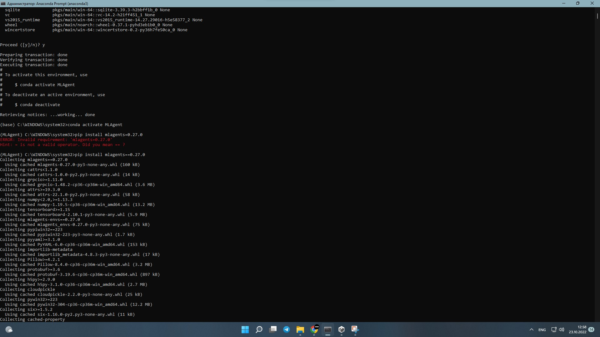

# lab-work_1
 # АНАЛИЗ ДАННЫХ И ИСКУССТВЕННЫЙ ИНТЕЛЛЕКТ [in GameDev]
Отчет по лабораторной работе #1 выполнил(а):
- Владимир Андреевич Жирнов
- РИ210947
Отметка о выполнении заданий (заполняется студентом):

| Задание | Выполнение | Баллы |
| ------ | ------ | ------ |
| Задание 1 | * | 60 |
| Задание 2 | * | 20 |
| Задание 3 | # | 20 |

знак "*" - задание выполнено; знак "#" - задание не выполнено;
Работу проверили:
- к.т.н., доцент Денисов Д.В.
- к.э.н., доцент Панов М.А.
- ст. преп., Фадеев В.О.

Структура отчета

- Данные о работе: название работы, фио, группа, выполненные задания.
- Цель работы.
- Задание 1.
- Код реализации выполнения задания. Визуализация результатов выполнения (если применимо).
- Задание 2.
- Код реализации выполнения задания. Визуализация результатов выполнения (если применимо).
- Задание 3.
- Код реализации выполнения задания. Визуализация результатов выполнения (если применимо).
- Выводы.
- ✨Magic ✨

## Цель работы
Ознакомиться с моделью перцептрона и научиться решать простые логические задачи.

## Задание 1
### В проекте Unity реализовать перцептрон, который умеет производить вычисления:
	OR | дать комментарий о корректности работы
	AND | дать комментарий о корректности работы
	NAND | дать комментарий о корректности работы
	XOR | дать комментарий о корректности работы

- Для Unity в отчете привести скриншоты вывода сообщения Hello World в консоль.

[!image](https://github.com/Nthokar/lab-work_1/blob/lab_work_4/screenshots/XOR_Unity.png)
## Задание 2
### Построить графики зависимости количества эпох от ошибки обучения. Указать от чего зависит необходимое количество эпох от обучения.

## Задание 3
### Какова роль параметра Lr? Ответьте на вопрос, приведите пример выполнения кода, который подтверждает ваш ответ. В качестве эксперимента можете изменить значение параметра.

## Выводы

Абзац умных слов о том, что было сделано и что было узнано.

| Plugin | README |
| ------ | ------ |
| Dropbox | [plugins/dropbox/README.md][PlDb] |
| GitHub | [plugins/github/README.md][PlGh] |
| Google Drive | [plugins/googledrive/README.md][PlGd] |
| OneDrive | [plugins/onedrive/README.md][PlOd] |
| Medium | [plugins/medium/README.md][PlMe] |
| Google Analytics | [plugins/googleanalytics/README.md][PlGa] |

## Powered by

**BigDigital Team: Denisov | Fadeev | Panov**
